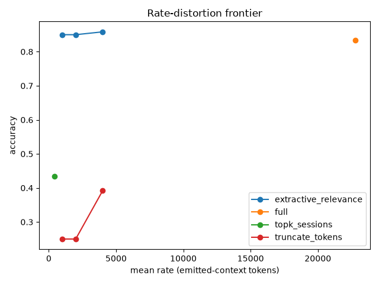

# Benchmarks

Recall pipeline is benchmarked against
[LongMemEval-S](https://github.com/xiaowu0162/LongMemEval).

## Current numbers

| Metric | Reranker on | RRF-only | cross-encoder delta |
|---|---|---|---|
| **R@5** | **99.4%** | 95.2% | +4.2pp |
| R@1 | 94.0% | 81.2% | +12.8pp |
| R@10 | 99.6% | 96.8% | +2.8pp |
| MRR | 0.962 | 0.873 | +0.089 |

**RRF-only** (`2026-06-23`, same stack with `TRUTHSAYER_URL` empty so
`core.Recall` skips the cross-encoder — the production reranker-down / no-GPU
degradation path) is the 5-tier RRF fan-out *without* rerank. It lands at
95.2% R@5 on its own, so a GPU-less deployment is viable; the cross-encoder is
a meaningful **rank-1-precision** upgrade (+12.8pp R@1 — it most affects
putting the single best hit first) rather than a near-necessity at R@5. The
reranker-on numbers are the headline; the RRF-only column quantifies what the
GPU buys.

500 questions, reranker-on run `2026-05-17` against the stack with
`BAAI/bge-reranker-v2-m3` fp16 on 8k context (the upgrade that landed
in commit `ca2eaec` + `593c293`; replaces the earlier
`bge-reranker-base` baseline of R@5=97.4% / R@1=91.4% / R@10=98.2% /
MRR=0.939). Past the 96.6% [MemPalace](https://github.com/MemPalace/mempalace)
reference. No LLM-as-judge, no leaderboard tricks — workspace scoping
plus the 5-tier RRF fan-out plus cross-encoder rerank
(see [recall-pipeline.md](recall-pipeline.md)).

### Per-category breakdown

| Category | N | R@1 | R@5 | R@10 | MRR |
|---|---|---|---|---|---|
| knowledge-update | 78 | 98.7% | 100.0% | 100.0% | 0.994 |
| multi-session | 133 | 92.5% | 99.2% | 99.2% | 0.952 |
| single-session-assistant | 56 | 100.0% | 100.0% | 100.0% | 1.000 |
| single-session-preference | 30 | 73.3% | 96.7% | 100.0% | 0.830 |
| single-session-user | 70 | 97.1% | 100.0% | 100.0% | 0.982 |
| temporal-reasoning | 133 | 93.2% | 99.2% | 99.2% | 0.958 |

`single-session-preference` remains the stickiest category and is the
open work for the next recall-pipeline iteration.

## Pinned configuration (2026-05-17 run)

The published numbers were produced with exactly this stack; treat any
deviation as a different experiment.

| Knob | Value |
|---|---|
| RRF_K | 60 |
| RERANK_TOPK | 50 |
| RERANK_WEIGHT | 0.5 |
| RERANK_TIMEOUT | 30s |
| TIER_TIMEOUT | 10s |
| Reranker | BAAI/bge-reranker-v2-m3, fp16, max_length 8192 (CUDA) |
| Embedder | Qwen3-Embedding-0.6B, 1024-dim, served by vLLM (fp16) |
| Dataset | LongMemEval-S, 500 questions |
| Harness | GHOLA_V2_DELEGATE=1 (core.Recall end-to-end) |

These are the `core.Config` defaults (`internal/core/core.go`,
`New()`); `RRF_K`, `RERANK_TOPK`, `RERANK_WEIGHT`, and
`GHOLA_TIER_TIMEOUT_MS` are env-overridable (`cmd/ghola/main.go`).
`RERANK_TIMEOUT` is a code default only. Reranker/embedder values are
the committed `deploy/docker-compose/docker-compose.yml` defaults
(`truthsayer` and `guild` services).

Caveats, stated plainly:

- Variance: re-validated 2026-06-10/11 with three independent retrieval
  runs against the same corpus and configuration — every metric
  reproduced identically (R@1 94.0 / R@5 99.4 / R@10 99.6 / MRR 0.962,
  per-category breakdown included). The pipeline is deterministic;
  run-to-run variance is nil. The 2026-06 runs also executed on the
  post-refactor codebase (recall fan-out rewrite, shared embedding
  client, per-tier timeouts), confirming those changes behavior-neutral.
- These are retrieval metrics (R@k over evidence sessions), not
  end-to-end QA accuracy. They are not comparable to QA-accuracy numbers
  other systems report on the same benchmark.
- Serving-stack sensitivity: these numbers were produced with the
  embedder served by vLLM at fp16. Serving the same model through a
  different stack or quantization (e.g. llama.cpp with a Q8_0 GGUF)
  changes the embeddings — re-validate before comparing against these
  numbers.

## QA accuracy & distillation frontier

The numbers above are **retrieval** metrics (R@k over evidence sessions).
End-to-end QA accuracy is a separate, additional metric: it measures
whether a reader, given the retrieved context, produces an answer a judge
scores as correct. The stage is implemented in
[`bench/longmemeval/qa/`](../bench/longmemeval/qa/) (the `lme-qa` package).
The full-500 QA-accuracy number is still pending; the first result produced
with this stage is the **rate-distortion frontier** below (the P5
distillation measurement).

| Knob | Value |
|---|---|
| Reader | `claude-opus-4-8`, adaptive thinking, Batches API |
| Judge | `claude-opus-4-8`, adaptive thinking, Batches API |
| Judge prompts | upstream [LongMemEval](https://github.com/xiaowu0162/LongMemEval) `evaluate_qa.py` (`get_anscheck_prompt`), ported verbatim |
| Judge verdict parsing | leading-token `yes` check — deliberately stricter than upstream's substring rule, since our judge is not `max_tokens`-capped to 10 and may emit visible preamble |
| Reader context | top-10 retrieved sessions per question (matches the published R@10) |
| Abstention (`_abs`) | handled per upstream protocol (abstention judge prompt; bucketed into the base question_type) |
| Dataset | LongMemEval-S, 500 questions |
| Access path | the Batches API **or** Claude Code headless mode (`claude -p`) with MCP/tools/plugins stripped via isolation flags; both pin `claude-opus-4-8`. The report footer records which path produced the number (`via batches` / `via claude-code`). |

Stated plainly:

- QA accuracy depends on the **reader** and the **judge** as much as on
  retrieval. A perfect retriever still loses points if the reader
  misreads the context or the judge scores strictly. Numbers will be
  reported only with all three (reader, judge, retrieval config) pinned.
- Retrieval R@k and QA accuracy are **different metrics and must not be
  cross-compared** — neither against each other nor against another
  system's number measured with a different reader/judge.
- The reader and judge both run as Opus 4.8 (operator decision); a
  different judge model would produce different accuracy on the same
  answers.
- Claude Code headless mode is a **different serving harness** than the
  raw Batches API: the model is the same (`claude-opus-4-8`), but the
  wrapper around it differs. The report footer records the access path
  (`via batches` / `via claude-code`) so any run is auditable, and the
  claude-code path strips MCP servers, tools, and plugins so the reader
  cannot reach context the benchmark withholds.

### Rate-distortion frontier (P5 distillation, first measurement 2026-06-22)

Distillation framed as rate-distortion compression of memory against the
reader's prior: how few tokens of context can we hand the reader and still
get the answer right? Each compressor reduces a question's retrieved context
to a token budget; we measure **rate** (emitted-context tokens, cl100k) and
**distortion** (QA wrong-fraction). The frontier is the achievable
accuracy-vs-tokens trade; the best compressor sits furthest upper-left.

n=120 (20/question-type, stratified subset of LongMemEval-S), reader+judge
`claude-opus-4-8` via Claude Code, context from the `2026-05-17` retrieve run.



| compressor | rate (tok) | accuracy | ±95% CI |
|---|---|---|---|
| **full** (no compression) | **22,760** | **83.3%** | ±6.7 |
| extractive_relevance @1000 | 993 | 85.0% | ±6.4 |
| extractive_relevance @2000 | 1,994 | 85.0% | ±6.4 |
| extractive_relevance @4000 | 3,994 | 85.8% | ±6.3 |
| truncate_tokens @1000 | 1,000 | 25.0% | ±7.8 |
| truncate_tokens @2000 | 2,000 | 25.0% | ±7.8 |
| truncate_tokens @4000 | 4,000 | 39.2% | ±8.8 |
| topk_sessions @2000 | 403 | 43.3% | ±8.9 |

What it shows:

- **Relevance-aware selection recovers full-context accuracy at ~1,000
  tokens — a ~23x reduction at no measurable cost.** `extractive_relevance`
  (score each retrieved turn against the question with the bge-reranker, keep
  the highest until the budget) holds 85.0% at 993 tokens vs full-context
  83.3% at 22,760 tokens; the two CIs overlap, so the reduction is free. The
  curve is flat from 1k–4k — ~1k is the knee.
- **Relevance is the whole game.** At an equal ~1,000-token budget,
  relevance-aware selection scores 85.0% vs blind `truncate_tokens` at 25.0%
  — a **+60pp** gap. Truncation keeps the chronologically-oldest turns, which
  are almost never the evidence. `topk_sessions` (whole-session granularity)
  also lags badly (43.3%): at a tight budget the oldest session alone often
  overflows it, emitting little or nothing.
- **Less may be slightly better, not just cheaper.** extractive at 1k
  edges full (85.0 vs 83.3, within CI) — consistent with 22k tokens of
  mostly-irrelevant context diluting the evidence that ~1k of relevant turns
  presents cleanly.

This is the Stage-A baseline frontier. Stage B (`perplexity_prune`,
`llm_distill`) aims to push the knee below ~1k by removing redundancy *inside*
the relevant turns. Reproduce with `lme-qa-sweep` → `lme-qa-rd` (see
[`bench/longmemeval/README.md`](../bench/longmemeval/README.md)); rate is the
emitted-context token count, **not** the reader's `usage.input_tokens` (which
on the claude-code backend is fixed harness overhead).

Caveats: n=120 subset (not the full 500); QA accuracy is a different metric
from the retrieval R@k above and must not be cross-compared; the rate unit is
a cl100k proxy for Claude's tokenizer (absolute counts ~10-20% off, frontier
shape exact).

### Per-category breakdown (n=120 subset, hypothesis-generating)

The n=120 subset is stratified 20/question-type, so per-category CIs are wide
(±~20pp). These numbers are **suggestive, not conclusive** — they point at
where to focus the full-500 run, not where to draw final conclusions.

| Category | full | extractive@1000 | truncate@1000 |
|---|---|---|---|
| single-session-preference | 60% | 60% | 10% |
| temporal-reasoning | 85% | 75% | 0% |
| knowledge-update | 85% | 95% | 35% |
| multi-session | 75% | 80% | 25% |

The **temporal-reasoning** dip (75 vs 85) is the sharpest signal. Preference
is the hardest category (lowest for both full and extractive), but it's
**reasoning-hard, not selection-hard** — full context doesn't help either
(60% on both), so extractive isn't where it loses. The temporal dip suggests
extractive selection drops the low-relevance *connective* turns between
high-relevance ones that establish "X happened, then Y, then Z." The
evidence points at temporal, not preference, as the category where extractive
selection has a structural limitation.

A new compressor, `extractive_relevance_expanded`, tests this hypothesis: after
greedy relevance selection, it admits each kept turn's immediate predecessor
and successor (one-hop neighbor expansion) if budget allows. Falsifiable
prediction: if the temporal dip closes, it was lost connective tissue; if not,
temporal questions genuinely need the fuller session. The compressor is in the
registry alongside the others; sweep it at `@1000` to compare against
`extractive_relevance@1000` on the temporal category.

### Connection to mentat's session pooler (PR8 prediction)

The rate-distortion frontier measures dilution at the **turn-selection**
level: 22k tokens of averaged-everything loses to 1k tokens of
relevant-only. Mentat's session pooler
([`mentat/mentat/pooler.py`](../mentat/mentat/pooler.py)) enshrines the same
dilution at the **embedding** level: it mean-pools every event's embedding
with type-based weights (`user: 1.0, assistant: 0.5, tool_result: 0.1,
system: 0.0`), washing out the single highly-relevant turn the way full-
context rendering washes out the single relevant passage.

The frontier is therefore indirect quantitative evidence for PR8's attention
pool: if extractive selection recovers signal by keeping less-but-relevant,
an attention-weighted pool should recover signal by weighting less-but-
relevant. **Falsifiable prediction**: an attention pool (PR8's
`AttentionPool`) should beat the mean pool, and the delta should be largest
on sessions with high variance in per-turn relevance — the same sessions where
extractive selection at 1k beats full-context at 22k. The two experiments
measure the same principle (relevance-weighted selection beats uniform
averaging) at different granularities (turn-level vs embedding-level).

## Running the harness

The ghola backend adapter lives in this repo at
[`bench/longmemeval/ghola_backend.py`](../bench/longmemeval/ghola_backend.py).
The upstream [LongMemEval](https://github.com/xiaowu0162/LongMemEval)
harness + dataset stay external. Drop the adapter into a LongMemEval
clone's `backends/` dir per
[`bench/longmemeval/README.md`](../bench/longmemeval/README.md), then:

```sh
# from your LongMemEval clone, with ghola running (make dev-up):
GHOLA_V2_DELEGATE=1 .venv/bin/python run.py retrieve \
  --backend ghola_v2 --dataset s
.venv/bin/python run.py evaluate --run results/ghola_v2_s_<ts>.jsonl
```

`GHOLA_V2_DELEGATE=1` routes recall through `core.Recall` end-to-end
(workspace scoping + RRF fusion + rerank); without it the adapter
falls back to a local cross-encoder rerank for comparison.

## Internal seeding-eval

`seeding-eval/` in this repo is a smaller, faster harness used to
sweep recall tuning (RRF_K, RERANK_TOPK, RERANK_WEIGHT) before
escalating a change to the full LongMemEval-S run. See
`seeding-eval/README.md` (if present) or `seeding-eval/pyproject.toml`
for entry points.
